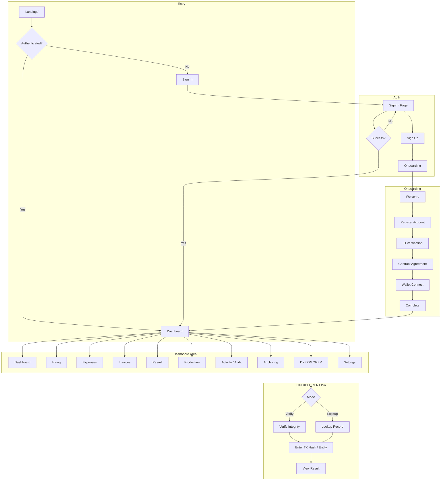

# User Flow Diagram — DXER

```mermaid
flowchart TD
    subgraph Entry
        A[Landing /] --> B{Authenticated?}
        B -->|No| C[Sign In]
        B -->|Yes| D[Dashboard]
    end

    subgraph Auth
        C --> E[Sign In Page]
        E --> F{Success?}
        F -->|Yes| D
        F -->|No| E
        E --> G[Sign Up]
        G --> H[Onboarding]
    end

    subgraph Onboarding
        H --> I[Welcome]
        I --> J[Register Account]
        J --> K[ID Verification]
        K --> L[Contract Agreement]
        L --> M[Wallet Connect]
        M --> N[Complete]
        N --> D
    end

    subgraph Dashboard["Dashboard Area"]
        D --> O[Dashboard]
        D --> P[Hiring]
        D --> Q[Expenses]
        D --> R[Invoices]
        D --> S[Payroll]
        D --> T[Production]
        D --> U[Activity / Audit]
        D --> V[Anchoring]
        D --> W[DXEXPLORER]
        D --> X[Settings]
    end

    subgraph DXEXPLORER["DXEXPLORER Flow"]
        W --> Y{Mode}
        Y -->|Verify| Z[Verify Integrity]
        Y -->|Lookup| AA[Lookup Record]
        Z --> AB[Enter TX Hash / Entity]
        AA --> AB
        AB --> AC[View Result]
    end
```
